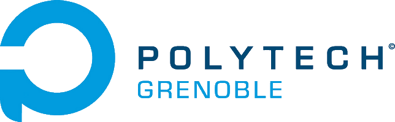
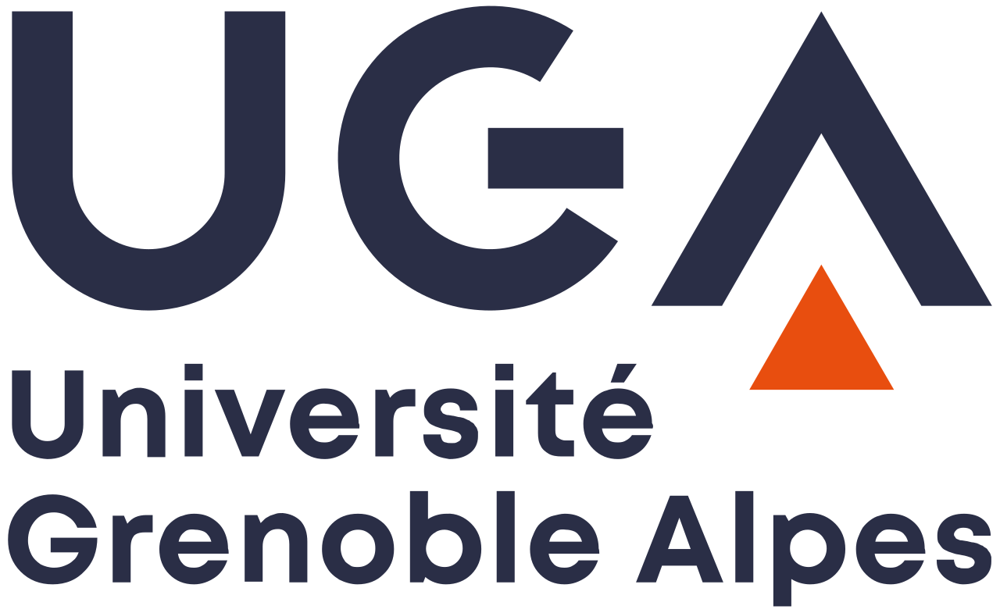
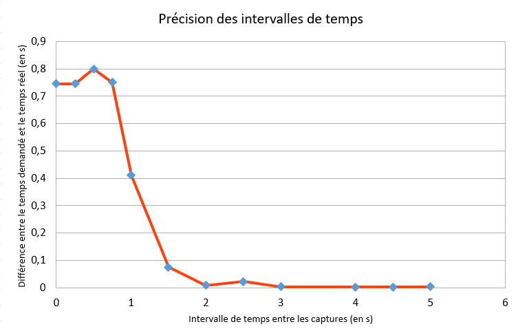
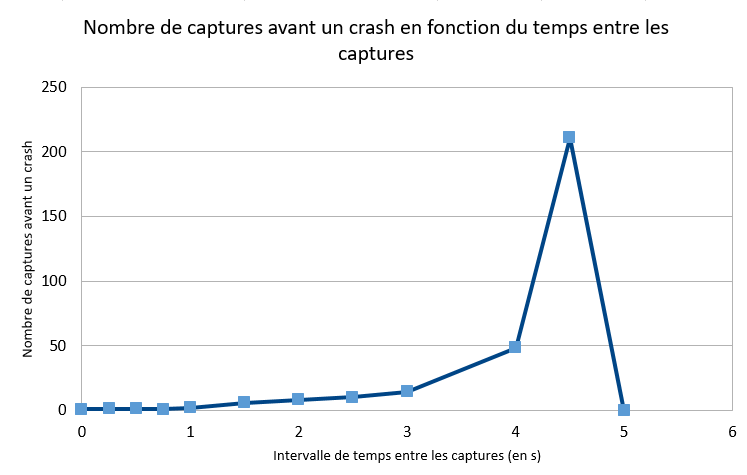
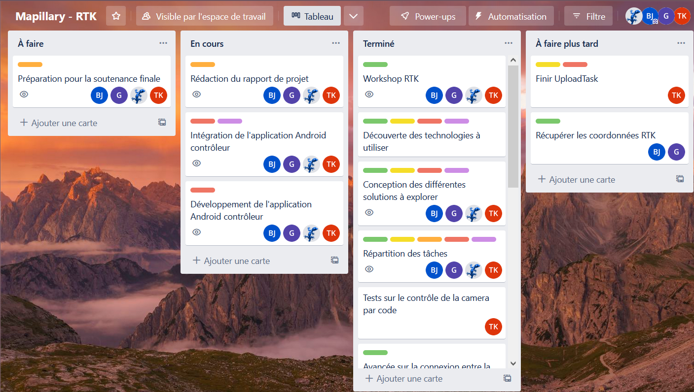
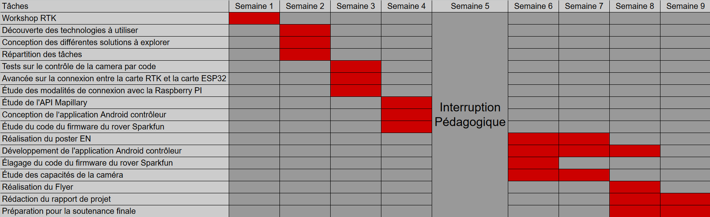
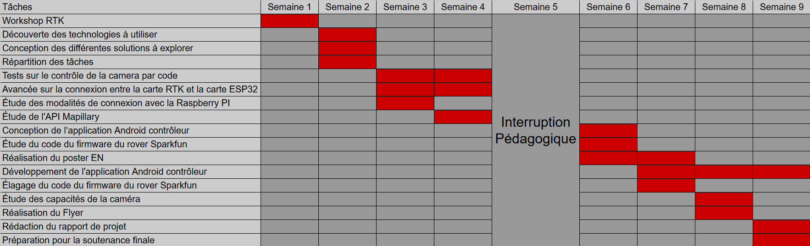
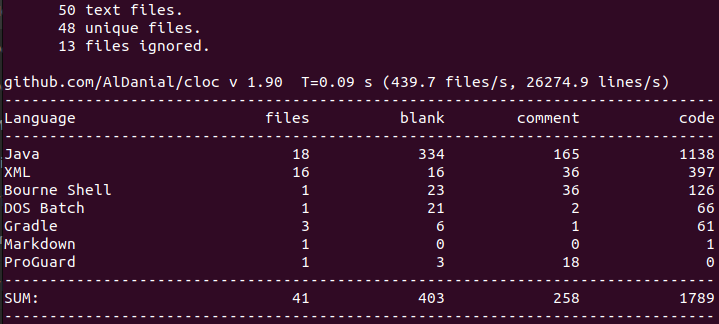
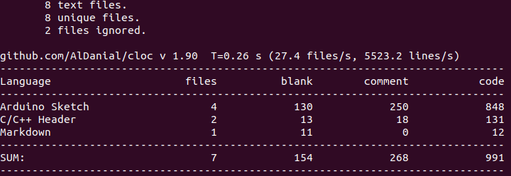
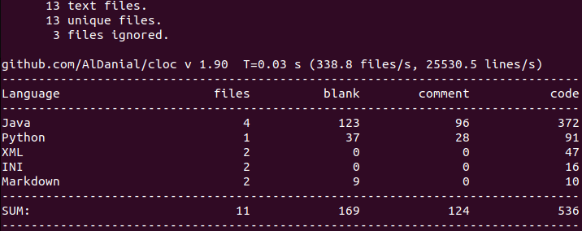

<h1 align="center">Rapport Projet Mapillary</h1>

FODOR Gergely -
CONJARD Samuel -
JARDIN Baptiste -
KACHA Tom

  

# Sommaire
 - [Rappel du sujet/besoin et cahier des charges](#sujet)
 - [Technologies employées](#tech)
 - [Architecture technique](#archi)
 - [Réalisations techniques](#real)
 - [Gestion de projet (méthode, planning prévisionnel et effectif, gestion des risques, rôles des membres ...)](#gestion)
 - [Outils (collaboration, CD/CI ...)](#outils)
 - [Métriques logicielles : lignes de code, langages, performance, temps ingénieur (d'après vos journaux), la répartition des lignes de code et des commits en pourcentage entre les membres du projet ...)](#metriques)
 - [Conclusion (Retour d'expérience)](#conclusion)
 - [Glossaire](#glossaire)
 - [Bibliographie](#bibli)

# Rappel du sujet 

  Mapillary est un service de visualisation d'espaces publics, à l'instar de Google Streetview. Ce service est basé sur les contributions de ses utilisateurs. Ainsi, quand un usager téléverse une photographie (à 360 degrés ou non), Mapillary traitera l’image de différentes manières, par exemple en floutant les visages/plaques d'immatriculation, puis la téléversera à son tour sur OpenStreetMap. Notre projet vise à développer des outils facilitant la contribution de photos/vidéos 360°, géolocalisées au centimètre près.

  La Cinématique temps réel (ou RTK, Real Time Kinematic) est une technique de positionnement par satellite qui permet de géolocaliser des composants au centimètre près.
Le but de notre projet est de créer un système permettant de relier ensemble une caméra 360° ainsi qu’un module RTK pour automatiser le processus de prise et téléversement de photographie 360° sur les services de Mapillary.

# Technologies employées 

  Nous avons utilisé un certain nombre de technologies différentes au cours du projet.

### Réseau Centipede RTK

  Le réseau Centipede RTK est composé d’un ensemble de bases Centipede. Chacune connaît sa localisation GPS exacte au centimètre près, et demande à courts intervalles réguliers sa position aux satellites, afin de déterminer la différence entre sa position réelle et sa position supposée par les satellites. Cette différence est matérialisée sous la forme de données de correction.

  Afin de pouvoir profiter des fonctionnalités du réseau Centipede RTK, il faut utiliser un client “n-trip”. Après le choix de la base, le client reçoit les données de correction de la zone. Les bases ont une portée limitée d’environ 50 kilomètres, il faut donc s’assurer de rester dans leur zone pour obtenir des données de correction pertinentes. Bien sûr, plus le client s’éloigne du centre de la base, moins les corrections données lui sont pertinentes, même s’il reste dans la portée des 50 kilomètres.

### Module Ublox ZED-F9P/Carte GNSS RTK Click

  Le module ZED-F9P est un récepteur GNSS permettant d’obtenir des coordonnées GPS très précises. Il est composé d’une antenne GNSS, qui reçoit les signaux GPS, GLONASS, Galileo, et BeiDou, et est intégré à une carte GNSS RTK, qui possède des connecteurs I2C qui leur permettent de transmettre des données à d’autres composants électroniques. Le module fonctionne de la manière suivante : Il reçoit des coordonnées GPS imprécises depuis son antenne, et les rectifie en se basant sur les données de correction de la base Centipede sélectionnée fournies par le client n-trip, qu’il reçoit depuis les connecteurs de la carte GNSS. Il renvoie ensuite dans ses connecteurs les coordonnées corrigées sous forme de paquets RTCM.

  La carte GNSS RTK permet de faire de la connectique (alimentation, antenne, connecteurs UART, etc.), afin de pouvoir lier et utiliser le module.

### Carte ESP32

  La carte ESP32 est utilisée à des fins de communication. Quand elle est mise en route, elle charge le programme qui y est inscrit. Le but de cette carte est de faire communiquer le client n-trip, qui communique par Bluetooth, et le module ZED-F9P, qui communique par I2C. Autrement dit, faire transiter les données de correction et les coordonnées GPS corrigées. Dans le cadre de ce projet, il s’agit du seul composant électronique nécessitant un paramétrage et une programmation pour fonctionner.

### Caméra Ricoh Theta SC

  La caméra Ricoh Theta SC est une caméra permettant de prendre des photos et des vidéos à 360° et qui fournit une API gérée par un serveur HTTP interne permettant de créer des applications exploitant les fonctionnalités de la caméra.

### Mapillary

  Mapillary est un outil qui extrait des données cartographiques depuis des images. Il utilise la vision par ordinateur ainsi que des algorithmes d’apprentissage automatique pour identifier des caractéristiques de la photo, telles que les visages et plaques d'immatriculation (à des fins de floutage), les panneaux de signalisation, les façades de bâtiment, etc. Une fois l’image traitée, elle est téléversée sur OpenStreetMap.

  Le service fournit également une API, qui permet de programmer une application utilisant certaines des fonctionnalités proposées par Mapillary. Nous souhaitions nous servir de l’API pour téléverser les photos corrigées à partir d’une application mobile.

# Architecture technique 

Architecture du projet

  L’architecture que nous avons adoptée relie les deux composants électroniques à l’application Android. La caméra 360° est capable de se connecter en Wi-Fi, tandis que la carte ESP32 utilise le Bluetooth. La carte GNSS RTK, surmontée du module ZED-F9P, est reliée à l’ESP32 en Wi-Fi, tandis que le module reçoit des coordonnées GPS. Finalement, les photographies 360° aux coordonnées corrigées seront téléversées sur Mapillary en se connectant au service en Wi-Fi.

# Réalisations techniques 

  Nous avons créé une application qui permet à la fois de prendre des photographies 360° avec la caméra, ainsi que de les télécharger depuis la mémoire de cette même caméra.

  Notre application Android est composée de plusieurs “Task” et d’un programme principal. Les Tasks sont des classes qui étendent la classe Thread. Le but d’une Task est d’effectuer une action précise, comme par exemple prendre des photos avec la caméra. Le programme principal va quant à lui utiliser les tasks, parfois via des boutons de l’interface, pour réaliser l’objectif du projet. L’application contient aussi une classe CameraAPI qui est une boîte à outils permettant la communication avec la caméra.

### CaptureTask

  Comme son nom l’indique, cette Task a pour but de prendre des captures avec la caméra, elle utilise les méthodes de la classe CameraAPI afin de prendre des photos à intervalle de temps régulier. Les références de ces photos sont conservées dans la base de données afin de les télécharger par la suite. Cette Task est lancée en appuyant sur un bouton prévu à cet effet.

### DownloadTask

  Suite à l’utilisation de CaptureTask, nous obtenons un tableau contenant les références
des images capturées. Cette Task sert à télécharger ces images à partir de leurs références. Les images sont ainsi téléchargées dans un dossier interne à l’application et non dans la galerie photo du téléphone. Ce choix est le plus simple car cela ne pose pas de problème de permissions et parce que l’utilisateur ne veut pas forcément avoir une multitude de photos 360 degrés sur son appareil. Enfin, cette Task conserve un tableau contenant les chemins de toutes les images téléchargées.

### GpsTask

  Cette Task permet de récupérer les coordonnées GPS (lattitude et longitude) de  l’utilisateur lorsqu’elle est appelée, via la méthode getLastLocation de la classe GPS_Manager. Ces coordonnées sont alors stockées dans la base de données afin d’être associées à une photo capturée.

### UploadTask

  Une fois les photos téléchargées et liées à une coordonnée GPS, cette Task permet de téléverser ces images sur Mapillary via son API. Pour cela, elle récupère les chemins des images ainsi que leurs coordonnées GPS, puis elle se connecte à l’API via son authentification OAuth 2.0, puis elle met en ligne les photos, vérifie que le téléversement s’est bien passé via les réponses des requêtes, puis supprime les photos stockées dans l’application. Malheureusement, nous n’avons pas pu aller au bout de la réalisation de cette Task car la mise en ligne des photos automatiquement n’est pas prise en charge par l’API de Mapillary. Il existe des outils pour les mettre manuellement sur Mapillary mais il n’y a aucun moyen de le faire via des requêtes. Néanmoins, cette API est en constant développement donc cela pourrait être pris en compte à l’avenir. Cependant, la récupération des images et des coordonnées GPS, l’authentification à l’API ainsi que la suppression des photos fonctionnent.

# Problèmes rencontrés et limitations

### Limites de l’API Mapillary

  Mapillary propose un certain nombre de services nécessitant l'action manuelle de l’utilisateur, ainsi qu’une API qui permet d’automatiser certaines de ses fonctionnalités. Le but de notre projet étant d’automatiser le processus de téléversement des photographies 360° sur Mapillary, nous souhaitions donc utiliser l’API pour téléverser les photographies aux coordonnées corrigées sur les serveurs de Mapillary. Malheureusement, nous avons découvert que l’API ne propose **aucune** méthode pour téléverser les images.

  Cette limitation majeure nous empêche d’automatiser totalement notre application, et force l’intervention de l’utilisateur dans cette étape du processus. Cela dit, la méthode d’authentification à l’API mentionne un “upload scope”, malgré l’absence de méthodes liées au téléversement. Cette information, en plus du fait que Mapillary est un service en constante évolution, semble indiquer que, sinon prévue, la possibilité de téléverser automatiquement des images à partir de l’API est une fonctionnalité qui pourra être développée dans le futur.

### Limites de la caméra

  La caméra 360° RICOH Theta SC que nous avons longuement testée et utilisée pendant notre projet possède quelques limites liées à son API qui ont gêné la réalisation du projet. Cette caméra n’a en effet pas été créée pour ce genre d’utilisation mais plutôt pour le loisir. De plus, ce n’est pas un modèle récent même parmi les caméras RICOH Theta. Cela explique pourquoi les capacités de l’API et du serveur sont limitées.

  Tout d’abord, avant d’envoyer une requête à la caméra, il est impératif d’envoyer une requête qui va démarrer une session afin de pouvoir communiquer par la suite, la première limitation que nous avons rencontré est que l’API ne permet pas de fermer cette session. A cause de cela, si l’utilisateur utilise l’API, ferme l’application puis la réutilise sans se déconnecter de la caméra, la caméra va garder ouverte la dernière session et ainsi lors de la création d’une nouvelle session cela provoquera une erreur. Pour pallier ce problème, il faut entre chaque utilisation de l’application se déconnecter et se reconnecter à la caméra, ou l’éteindre et la rallumer, afin de réinitialiser la session. 

  Un autre obstacle auquel nous avons dû faire face est le temps de traitement des images. En effet, si on veut récupérer la référence d’une image directement après l’avoir prise, il faut attendre environ 2 secondes, ce qui ralentit le processus. Pour régler ce problème, nous avons utilisé une requête qui permet de connaitre la référence de la dernière image prise, et comme les références se suivent (exemple : 0011016 → 0011017) , nous pouvons connaître la référence d’une photo avant même de la prendre. Néanmoins, la première photo de la session ne peut pas bénéficier de cet avantage donc il est obligatoire d’attendre la fin du traitement de l’image.

  Le problème précédent nous a questionné à propos de l’utilisation de threads pour les requêtes vers la caméra. En effet, s'il était possible de prendre une photo, attendre son traitement puis la télécharger en arrière plan dans un thread séparé, cela améliorerait beaucoup notre application. Malheureusement, la caméra 360° est monothreadé et ne peut pas répondre à plusieurs requêtes en même temps, nous sommes ici limités par l’appareil.

  Même si nous savions qu’il ne fallait pas faire plusieurs requêtes en même temps, nous nous sommes vite rendu compte que nous ne pouvions même pas faire plusieurs requêtes proches dans le temps. Par exemple, prendre une photo toutes les deux secondes n’est pas possible car la caméra renvoie alors une erreur 503 indiquant que le serveur HTTP est surchargé. Notons que cette erreur ne signifie pas la fin de l’exécution des captures, ce que l’on appelle un crash est une capture qui échoue, renvoyant une erreur 503, mais le programme continue et les captures suivantes peuvent fonctionner, parfois même bien. Comme pour le problème précédent, nous sommes limités par l’appareil, mais nous pouvons tester et évaluer ces limites. Les deux graphes suivants sont le résultat d’un grand nombre de tests pour savoir quelle est la durée minimale entre deux requêtes qui ne provoque ni crash ni temps d’attente supplémentaire. Dans le premier, nous pouvons observer que en dessous de 4 secondes d’intervalle entre les prises de photo, la caméra était surchargée en moins de 50 photos, puis au dessus de 4 secondes les performances deviennent bonnes et à 5 secondes, il n’y a plus de crash mesuré, même après 1200 captures. Le deuxième graphique montre qu’en dessous de 2 secondes, les intervalles de temps mesurés entre les captures sont imprécis et plus longs que demandés, cela est dû au serveur qui prend du temps à traiter les requêtes avant de crasher. Par contre, au-delà de 2 secondes, l’écart devient très faible et les intervalles de temps sont respectés. On peut ainsi considérer qu’à partir de 5 secondes d’intervalle, la caméra peut être utilisée à pleine capacité car il ne semble plus y avoir de crash et la précision de l’intervalle de temps est à l’échelle de la milliseconde.

  Lors de nos longs tests dans lesquels nous effectuons plus de 1000 photos à la suite, une dernière limite de la caméra nous est apparue : son autonomie. Même avec une batterie pleine, nous n’avons pas pu utiliser continuellement la caméra plus d’1h30. En effet, cette caméra n’est à la base pas faite pour prendre des photos pendant des heures le temps d’une randonnée par exemple. Et malheureusement, la caméra ne permet pas la connexion WI-FI pendant qu’elle est en charge et ainsi ne permet pas à notre application de fonctionner si elle charge.

  Afin d’éviter la plupart des problèmes expliqués ci-dessus, la meilleure solution est de choisir une caméra plus performante et plus adaptée à cette utilisation. Par exemple, Google street view indique que pour collaborer avec eux, les caméras 360° suivantes sont adaptées et compatibles :
 - Insta360 Pro2
 - Insta360 Titan
 - Insta360 ONE X2
 - Insta360 ONE RS 1-Inch Edition
 - Insta360 X3
 - GoPro Max
 - Labpano Pilot Era
 - Ricoh Theta X

  Prenons l’exemple de la GoPro Max, cette dernière possède des modes de captures permettant de prendre des photos à des intervalles de 0,5 s, 1 s, 2 s, 5 s, 10 s, 30 s, 1 min. De plus, cette dernière à une plus grande autonomie. La Ricoh Theta X a quant à elle accès à une API plus complète grâce à sa version de firmware plus récente, permettant par exemple de fermer la session ou de prendre des photos à intervalle régulier en une seule requête.

### Limite temporelle

  Ce projet est un projet de recherche. La problématique étant ouverte et le projet étant limité à une durée de 2 mois, il est naturel que nous n’ayons pas pu réaliser tous nos objectifs. Notre plus grande limite a été l’intégration du RTK. Malgré le fait que nous ayons consacré beaucoup de temps et de ressources humaines à cette tâche, nous n’avons malheureusement pas eu le temps d’extraire la géolocalisation centimétrique. Ceci étant dit, nous avons construit le reste du projet avec un objectif de maintenabilité. En effet, l’application Android fonctionne actuellement avec les coordonnées GPS du smartphone (faible précision) mais si, dans le futur, notre projet est repris, il n’y aura rien à modifier dans le code ou la structure de l’application afin de supporter le RTK. Il suffira d’utiliser un client Ntrip comme BlueTooth GNSS et de le sélectionner comme application de position fictive dans les options de développeurs.

# Gestion de projet 

### Méthode

  Pour notre projet, nous avons utilisé la méthodologie agile Scrum, qui est l'une des approches les plus populaires de la méthodologie agile. La première étape que nous avons suivie a été la planification du sprint, qui est une période de deux semaines pendant laquelle nous avons travaillé sur une partie spécifique de notre projet. Nous avons évalué ce que nous pouvions réaliser pendant cette période et nous avons déterminé les tâches que chaque membre de l'équipe devait accomplir. Puis, chaque jour, nous faisions une réunion quotidienne de 10 à 15 minutes à la manière d’un Daily Scrum. Au cours de ces réunions, nous avons discuté de l'avancement de notre travail, des obstacles rencontrés et des tâches que nous avions prévues pour la journée. Enfin, à chaque fin de sprint, nous avons présenté notre travail accompli au cours du sprint et discuté des résultats entre nous et avec notre tuteur Nicolas Palix que nous voyions tous les lundis. Cela nous permettait d’examiner ce qui avait bien fonctionné pendant le sprint et ce qui pouvait être amélioré pour le suivant.

  La méthodologie agile Scrum nous a été très utile pour collaborer. En effet, cela nous a permis de travailler en équipe pour résoudre les problèmes et atteindre les objectifs de notre projet. De plus, cette gestion de projet agile nous a aidé à gagner en flexibilité car nous avons pu adapter les plans et les tâches en fonction de l’évolution du projet, des changements de priorités et des imprévus. Notre équipe a aussi pu obtenir des résultats rapides et réguliers car la méthodologie agile permettait de valider notre travail et de nous assurer qu'on était sur la bonne voie pour atteindre les objectifs du projet. La communication régulière et la collaboration au sein de l'équipe ont également été améliorées grâce à cette méthodologie qui nous a semblé très innovante pour la gestion de projet.

### Rôles

  Les rôles de notre projet ont été répartis de la façon suivante :

 - Gergely Fodor était notre chef de projet et responsable base de données ;
 - Tom Kacha était le Scrum Master ainsi que le responsable caméra ;
 - Baptiste Jardin était le responsable GPS ;
 - Samuel Conjard était le responsable gestion de données.

### Outils de gestion de projet

  Nous avons créé un Trello afin de mettre en place la méthodologie Agile susdite. À chaque tâche à effectuer, nous l’ajoutions au trello puis nous la déplacions lorsque cette dernière était terminée.

Gestion de projet sur Trello

### Planning

  Nous avons enfin créé un diagramme de Gantt afin de pouvoir comparer le planning prévisionnel et le planning effectif.

Planning prévisionnel

Planning effectif

# Outils 

Nous avons utilisé plusieurs outils afin de mener à bien notre projet. Tout d’abord, afin de bien collaborer, nous avons mis en place un serveur discord afin de pouvoir plus facilement communiquer. Aussi, ce serveur discord était relié à notre dépôt Git, ce qui permettait d’afficher directement depuis discord les nouveaux commits et d’être notifié en temps réel. Nous avons aussi utilisé Google Drive afin de pouvoir partager des documents tels que des schémas ou encore des rapports ou présentations. Nous avons également utilisé Canva afin de réaliser notre poster en Anglais et notre flyer.

Comme mentionné ci-dessus, nous avons créé un trello afin de nous aider à mettre en place une méthodologie agile.

Enfin, nous avons utilisé Android Studio comme IDE afin de développer notre application android. Nous avons développé notre application en Java et Android Studio mettait à disposition un mode débogage avec un téléphone portable android, ainsi qu’un émulateur permettant de faire tourner un système Android virtuel sur un ordinateur.

# Métriques logicielles 

Temps ingénieur total : 45 jours x 7 h/jours x 4 = 1260h

### Controller :

Nombre de commits : 43

### SourceTHETA : 

Nombre de commits : 7

### SourceRTK :

Nombre de commits : 4

### Doc :

Nombre de commits : ???

# Bibliographie 

API Mapillary : https://www.mapillary.com/developer/api-documentation/?locale=fr_FR

Caméras recommandées par Google street view : https://support.google.com/maps/answer/6281877?hl=fr#zippy=

Informations techniques de la GoPro Max : https://gopro.com/fr/fr/shop/cameras/max/CHDHZ-202-master.html?gclid=4ddad07bd8f11eeedf59b470e387d3a7&gclsrc=3p.ds&msclkid=4ddad07bd8f11eeedf59b470e387d3a7

API de Ricoh Theta : https://github.com/ricohapi/theta-api-specs/tree/main/theta-web-api-v2.1/getting_started.md

Bibliothèque permettant d'utiliser un grand nombre de modules, de protocoles et de plates-formes d'émetteurs-récepteurs différents sur l'IDE Arduino : https://github.com/thingsat/tinygs_2g4station/tree/main/Firmware/Arduino

Exemples RTK avec un terminal Wio : https://github.com/CampusIoT/tutorial/tree/master/wioterminal/examples/ZED-F9P_RTK

Ce repository contient le manuel du produit RTK et le micrologiciel qui s'exécute sur la gamme de produits SparkFun RTK : https://github.com/sparkfun/SparkFun_RTK_Firmware

Tutoriel permettant de créer l'environnement de construction pour le micrologiciel SparkFun RTK : https://docs.sparkfun.com/SparkFun_RTK_Firmware/firmware_update/#build-environment

Tutoriel de création de base de données SQLite sous Android : https://developer.android.com/training/data-storage/sqlite#java
