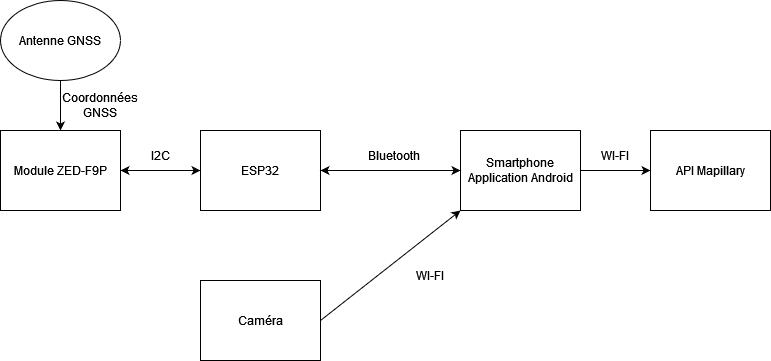

# Rapport Projet Mapillary

[Instructions du rapport](https://air.imag.fr/index.php/Projets_2022-2023)

## Sommaire
 - Rappel du sujet/besoin et cahier des charges
 - Technologies employées
 - Architecture technique
 - Réalisations techniques
 - Gestion de projet (méthode, planning prévisionnel et effectif, gestion des risques, rôles des membres ...)
 - Outils (collaboration, CD/CI ...)
 - Métriques logiciels : lignes de code, langages, performance, temps ingénieur (d'après vos journaux), la répartition des lignes de code et des commits en pourcentage entre les membres du projet ...)
 - Conclusion (Retour d'expérience)
 - Glossaire
 - Bibliographie

## Rappel du sujet

  Mapillary est un service de visualisation d'espaces publics, à l'instar de Google Streetview. Ce service est basé sur les contributions de ses utilisateurs. Ainsi, quand un usager téléverse une photographie (à 360 degrés ou non), Mapillary traitera l’image de différentes manières, par exemple en floutant les visages/plaques d'immatriculation, puis la téléversera à son tour sur OpenStreetMap. Notre projet vise à développer des outils facilitant la contribution de photos/vidéos 360°, géolocalisées au centimètre près.

  La Cinématique temps réel (ou RTK, Real Time Kinematic) est une technique de positionnement par satellite qui permet de géolocaliser des composants au centimètre près.
Le but de notre projet est de créer un système permettant de relier ensemble une caméra 360° ainsi qu’un module RTK pour automatiser le processus de prise et téléversement de photographie 360° sur les services de Mapillary.

## Technologies employées

  Nous avons utilisé un certain nombre de technologies différentes au cours du projet.

#### Réseau Centipede RTK

  Le réseau Centipede RTK est composé d’un ensemble de bases Centipede. Chacune connaît sa localisation GPS exacte au centimètre près, et demande à courts intervalles réguliers sa position aux satellites, afin de déterminer la différence entre sa position réelle et sa position supposée par les satellites. Cette différence est matérialisée sous la forme de données de correction.

  Afin de pouvoir profiter des fonctionnalités du réseau Centipede RTK, il faut utiliser un client “n-trip”. Après le choix de la base, le client reçoit les données de correction de la zone. Les bases ont une portée limitée d’environ 50 kilomètres, il faut donc s’assurer de rester dans leur zone pour obtenir des données de correction pertinentes. Bien sûr, plus le client s’éloigne du centre de la base, moins les corrections données lui sont pertinentes, même s’il reste dans la portée des 50 kilomètres.

#### Module Ublox ZED-F9P/Carte GNSS RTK Click

  Le module ZED-F9P est un récepteur GNSS permettant d’obtenir des coordonnées GPS très précises. Il est composé d’une antenne GNSS, qui reçoit les signaux GPS, GLONASS, Galileo, et BeiDou, et est intégré à une carte GNSS RTK, qui possède des connecteurs I2C qui leur permettent de transmettre des données à d’autres composants électroniques. Le module fonctionne de la manière suivante : Il reçoit des coordonnées GPS imprécises depuis son antenne, et les rectifie en se basant sur les données de correction de la base Centipede sélectionnée fournies par le client n-trip, qu’il reçoit depuis les connecteurs de la carte GNSS. Il renvoie ensuite dans ses connecteurs les coordonnées corrigées sous forme de paquets RTCM.

  La carte GNSS RTK permet de faire de la connectique (alimentation, antenne, connecteurs UART, etc.), afin de pouvoir lier et utiliser le module.

#### Carte ESP32

  La carte ESP32 est utilisée à des fins de communication. Quand elle est mise en route, elle charge le programme qui y est inscrit. Le but de cette carte est de faire communiquer le client n-trip, qui communique par Bluetooth, et le module ZED-F9P, qui communique par I2C. Autrement dit, faire transiter les données de correction et les coordonnées GPS corrigées. Dans le cadre de ce projet, il s’agit du seul composant électronique nécessitant un paramétrage et une programmation pour fonctionner.

#### Caméra Ricoh Theta SC

  La caméra Ricoh Theta SC est une caméra permettant de prendre des photos et des vidéos à 360° et qui fournit une API gérée par un serveur HTTP interne permettant de créer des applications exploitant les fonctionnalités de la caméra.

#### Mapillary

  Mapillary est un outil qui extrait des données cartographiques depuis des images. Il utilise la vision par ordinateur ainsi que des algorithmes d’apprentissage automatique pour identifier des caractéristiques de la photo, telles que les visages et plaques d'immatriculation (à des fins de floutage), les panneaux de signalisation, les façades de bâtiment, etc. Une fois l’image traitée, elle est téléversée sur OpenStreetMap.

  Le service fournit également une API, qui permet de programmer une application utilisant certaines des fonctionnalités proposées par Mapillary. Nous souhaitions nous servir de l’API pour téléverser les photos corrigées à partir d’une application mobile.

## Architecture technique

Architecture du projet

  L’architecture que nous avons adoptée relie les deux composants électroniques à l’application Android. La caméra 360° est capable de se connecter en Wi-Fi, tandis que la carte ESP32 utilise le Bluetooth. La carte GNSS RTK, surmontée du module ZED-F9P, est reliée à l’ESP32 en Wi-Fi, tandis que le module reçoit des coordonnées GPS. Finalement, les photographies 360° aux coordonnées corrigées seront téléversées sur Mapillary en se connectant au service en Wi-Fi.

