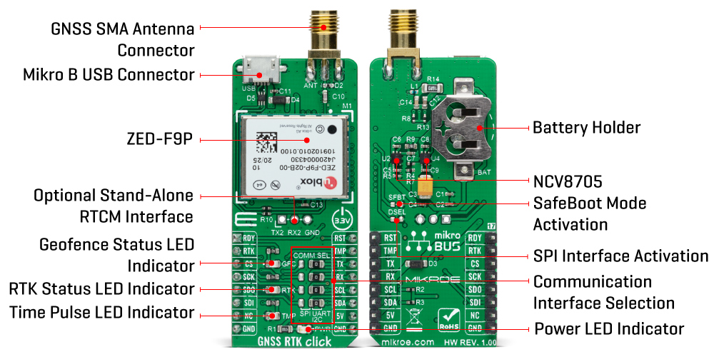
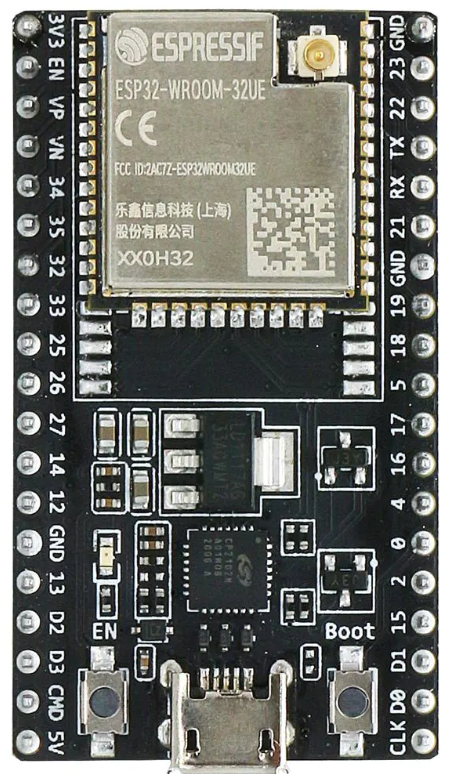
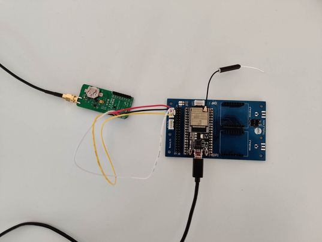
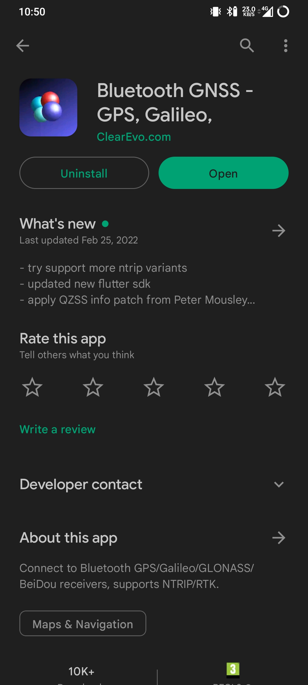
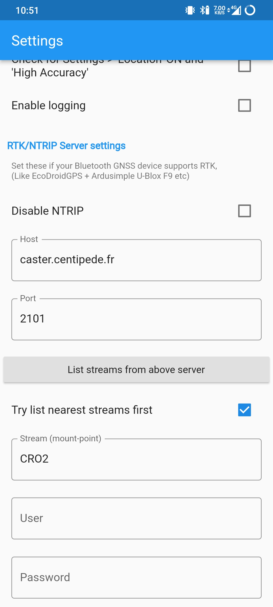
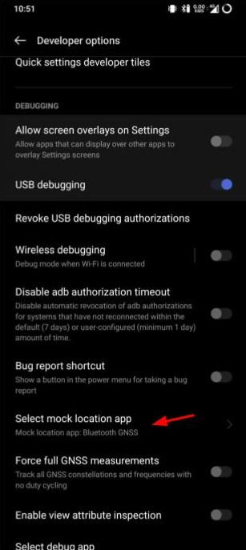
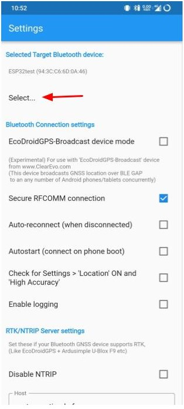
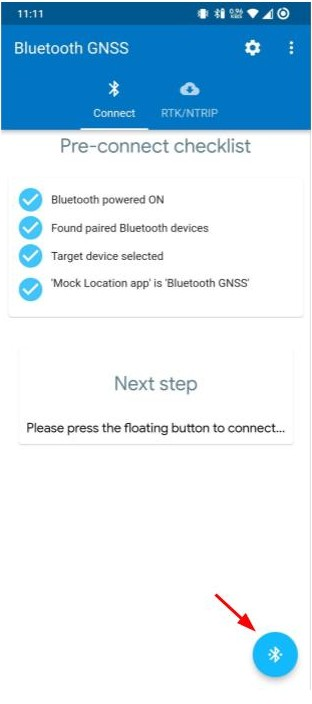

# RTK documentation

 This doc describes the hardware we have, how to setup the connections and all the information regarding the firmware.

## Hardware
We have several hardware available to us :

-  a [ZED-F9P](https://www.mikroe.com/gnss-rtk-click) module receives the GPS positions from the GNSS antena. It also receives the correction data from centipede, through a NTRIP client (which must be connected to the Internet). It returns accurate geolocalisation positions (about 1 centimeter accuracy).

- a GNSS antena that allows to receive geolocalisation signals (GPS, BeiDou, Galileo, GLONASS)

- a bluetooth antena that allows to communicate with a smartphone using bluetooth. This smartphone runs the NTRIP client which recieves data from centipede.

- an [ESP32](https://www.espressif.com/sites/default/files/documentation/esp32-wroom-32d_esp32-wroom-32u_datasheet_en.pdf) that allows WIFI and Bluetooth connection with an other board, the ZED-F9P in our case.

- a TinyGS card that links up the ESP32 with other devices.

## Connections
The grove connector must be pluged as the following : on the ESP32 it must be pluged on the I2C port, and on the F9P the white cable must be connected to SDA, the yellow one to SDL, the red one to the current (5V) and the black one to the ground (GND)

The GNSS antena must be connected to the GNSS Antena connector on the ZED-F9P

The bluetooth antena must be pluged on the ESP32

The micro USB cable links up the ESP32 with a computer for developing and debuging.

## Firmware

The firmware can be set up using Arduino IDE and a USB connection with the ESP32 board. Our goal is to flash the ESP32 board with a program that will transfert RTCM data packets from the Ntrip client to the ZED-F9P module and the high accuracy geolocalisation data frome the ZED-F9P to the smartphone.

### Firmware limitations

Due to a lack of time and previous experience, we were unfortunalty not able to finish setting up the firmware. We made a [repository](https://github.com/PolyMapi/sourceRTK) dedicated to our firmware testing. In the end, we were left with a modified version of SparkFun's RTK Surveyors firmware. T

he RTK Surveyor is a device made by Sparkfun that not only is an RTK rover but uses the same modules (ZED-F9P and ESP32). The RTK Surveyor does more than we need (WIFI support, RTK base, ...) so we would need to clear out the code a little but we are confident that with a couple of extra weeks dedicated to RTK, we could have made it work.

## Smartphone

We have written an Android prototype (see main repport) that can use the RTKs high accuracy. In order to use RTK on your smartphone, here are a few steps you need to follow.

* Download a Ntrip client app. We will use [BlueTooth GNSS](https://play.google.com/store/apps/details?id=com.clearevo.bluetooth_gnss) in this example.

* Set up the centiped stream. We use CRO2 as our mount point but you should find the mount point that's closest to you (you can use this [map](https://docs.centipede.fr/))

* Enable [developer options](https://developer.android.com/studio/debug/dev-options)

* Select your Ntrip client as a mock location app

* Select the target device, the ESP32 board

* Connect to the device

